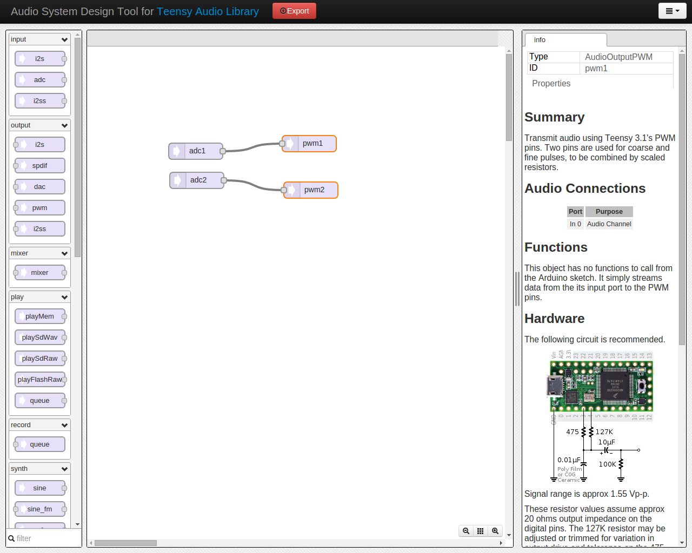

# teensyamp

[This](http://rdimitrov.twistedsanity.net/blog/show.php?entry=Microcontroller%20Class%20D%20Amplifier,%20Rev2) inspired me to make my own. But then with a teensy 3.2. This is my 1st project with ARM ucontroller, so I am learning while doing this project. 

##So..
the idea is to convert an analog (audio) signal to a digital value and use that to set a PWM which drives an H-bridge. This is a ADC-DAC conversion. 

##Version DMA

This version uses the [audiolib](http://www.pjrc.com/teensy/td_libs_Audio.html) by pjrc.

Initial code was generated using the [audio system disign tool](http://www.pjrc.com/teensy/gui/). 

like this:

##problem
We can instantiate ADC objects where we can choose the ADC pin, but we can't do the same with
PWM (yet). So I have to hack the code a bit. This is a TODO...
